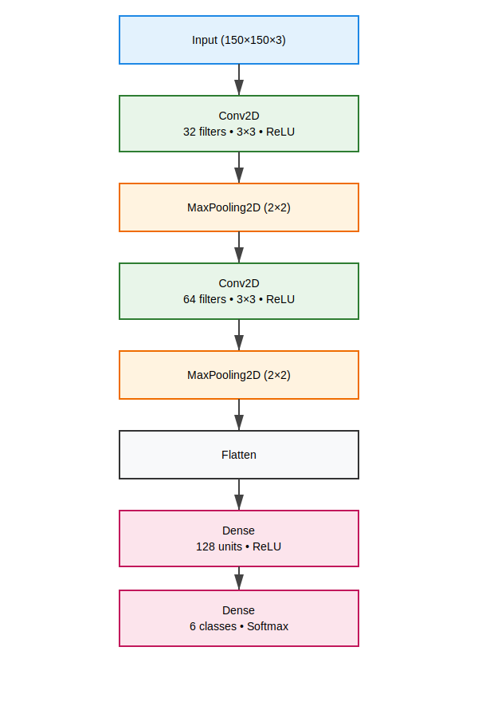
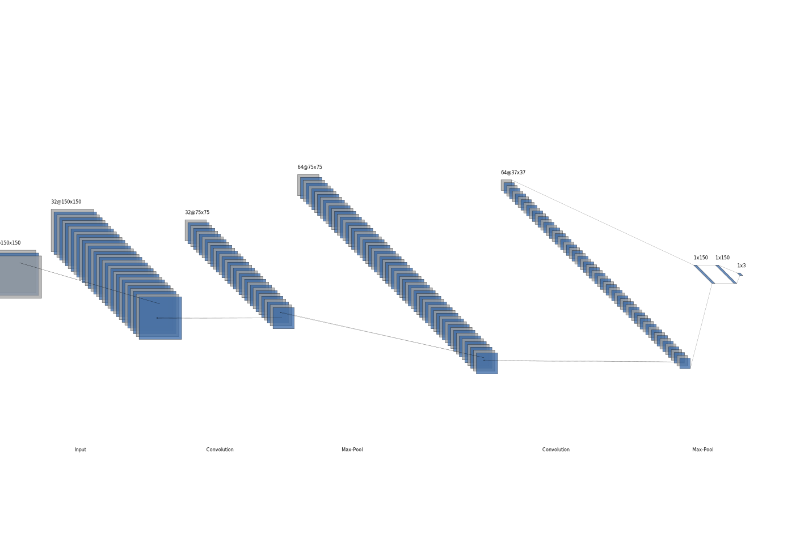
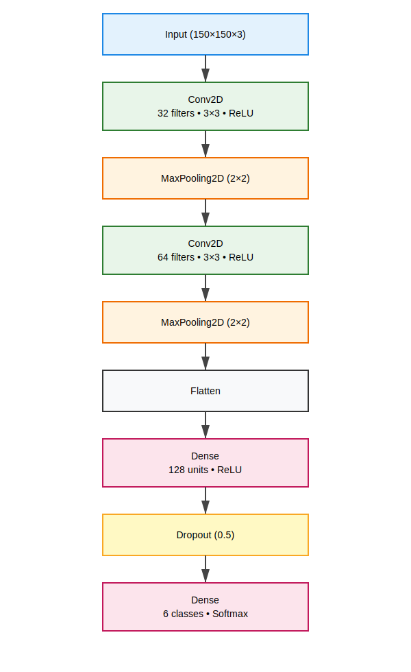
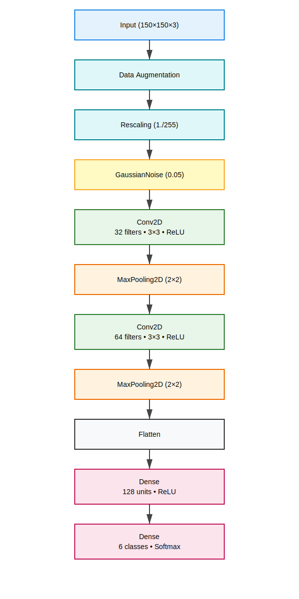
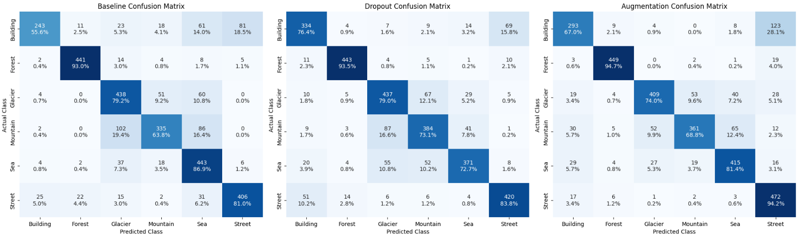
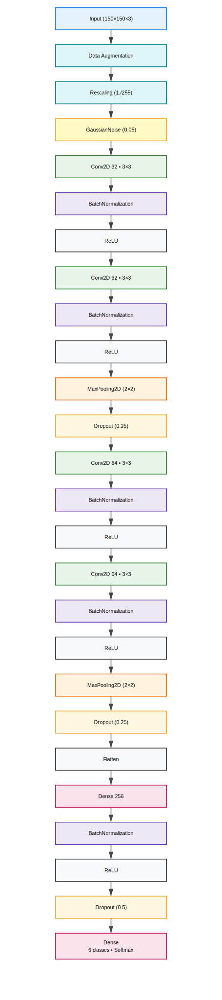
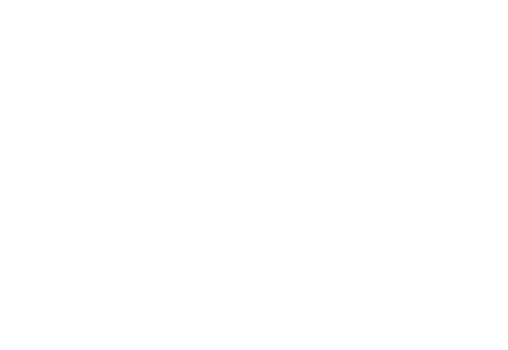
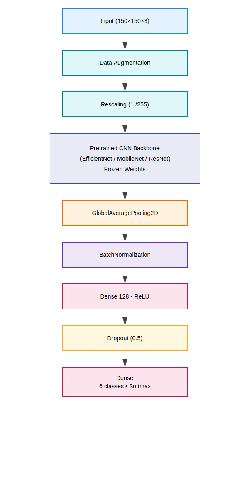
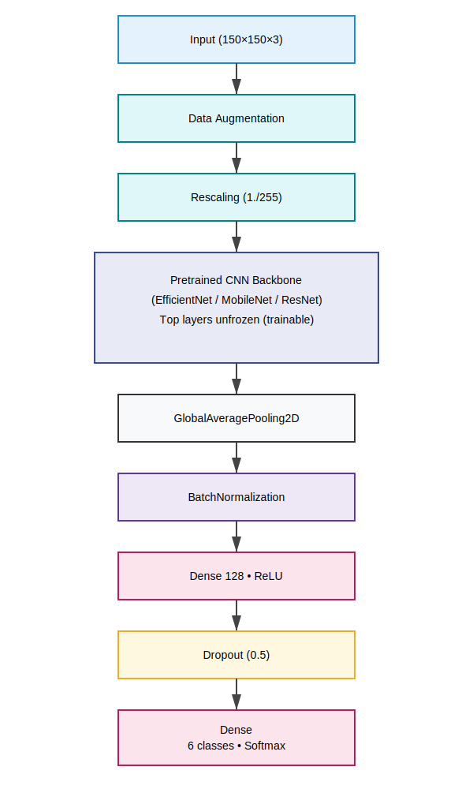
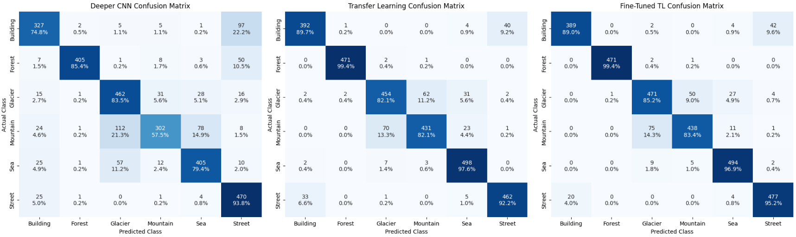

# Deep Learning for Image Classification: CNNs, Regularization, and Transfer Learning🧠🖼️

> Practical exploration of modern computer vision techniques including CNNs, data augmentation, dropout regularization, and transfer learning.

[](Introduction_to_TensorFlow_Wrap_Up.ipynb)
  

---

## 📖 Project Overview

This repository contains my **post-course exercises and experiments** after completing the [*Convolutional Neural Networks in TensorFlow*](https://www.coursera.org/learn/convolutional-neural-networks?utm_medium=sem&utm_source=gg&utm_campaign=b2c_latam_x_multi_ftcof_career-academy_cx_dr_bau_gg_pmax_gc_s1-v2_en_m_hyb_24-04_nonNRL-within-14d&campaignid=21239613742&adgroupid=&device=c&keyword=&matchtype=&network=x&devicemodel=&creativeid=&assetgroupid=6501905150&targetid=&extensionid=&placement=&gad_source=1&gad_campaignid=21320925518&gclid=CjwKCAjwyMnNBhBNEiwA-KcguxArxQAM6hjjjuHX3avQc-imyI3IOv_eYrJHay6mIzQg2U8MZn0OxxoCBJAQAvD_BwE) course on Coursera.

Instead of simply following the lectures, I created additional exercises to reinforce key computer vision concepts such as:

- Convolutional neural networks
- Data augmentation
- Regularization with dropout
- Transfer learning with pretrained models
- Multiclass image classification

The notebook documents my learning process through **hands-on experimentation and model improvements**.

---

## TL;DR

This project explores CNN performance on image classification tasks using regularization, data augmentation, and transfer learning.

Best model:

**Fine-tuned EfficientNetB0 → 91.33% accuracy**

---

## 🌍 Real-World Applications

Techniques explored in this project are widely used in:

• Autonomous driving scene understanding  
• Satellite image classification  
• Medical image diagnosis  
• Industrial defect detection  
• Smart city monitoring systems

---

## 📑 Table of Contents

- Project Overview
- Concepts Implemented
- Experiments
- Experiment 1 — Baseline CNN
- Experiment 2 — Natural Scene Classification
- Exercise 2 — Dropout Regularization
- Exercise 3 — Data Augmentation
- Exercise 4 — Improved CNN
- Exercise 5 — Transfer Learning
- Exercise 5.2 — Fine-Tuning
- Final Model Comparison
- Statistical Performance Analysis
- Key Lessons
- Final Results
- Tech Stack

---

## 🔍 Project Preview

| Model | Accuracy |
|------|------|
| Baseline CNN | 76.87% |
| CNN + Dropout | 79.63% |
| CNN + Augmentation | 79.97% |
| Transfer Learning | 90.27% |
| Fine-Tuned EfficientNet | **91.33%** |


---
## 🚀 Concepts Implemented

### 🧠 Convolutional Neural Networks
Understanding how CNNs detect patterns using convolutional filters and pooling layers.

### 🔄 Data Augmentation
Improving generalization using transformations like:
- Rotation
- Zoom
- Flipping
- Shifting

### 🧱 Dropout Regularization
Preventing overfitting by randomly deactivating neurons during training.

### 🧬 Transfer Learning
Using pretrained models to accelerate training and improve accuracy on small datasets.

### 🖼️ Multiclass Image Classification
Building models capable of distinguishing between **multiple categories of images**.

---

## 🧪 Experiments

The notebook contains several experiments exploring how architectural choices affect performance:

- Baseline CNN
- CNN with dropout
- CNN with data augmentation
- Changing Baseline CNN
- Transfer learning model
- Fine tuning transfer learning model

Each experiment compares training/validation accuracy and loss to understand model behavior.

---

## 🔬 Experimental Contribution

This project provides a systematic comparison of:

• CNNs trained from scratch  
• Regularization techniques  
• Data augmentation strategies  
• Transfer learning with pretrained CNNs  
• Fine-tuning strategies

The experiments demonstrate that transfer learning produces the most significant improvements in small-dataset computer vision tasks.

---
## ▶️ Reproducibility

This module consists of Jupyter notebooks that can be run locally or on Google Colab.

### Prerequisites

- Python 3.8 or higher
- pip
- Virtual environment support (recommended)

### 1. Clone the Repository

```bash
git clone https://github.com/victorperone/Convolutional_Neural_Networks_in_TensorFlow.git
cd What_I_Learned
```

### 2. Create and Activate a Virtual Environment (Recommended)

**Linux / macOS**
```bash
python3 -m venv venv
source venv/bin/activate
```

**Windows**
```bash
python -m venv venv
venv\Scripts\activate
```

### 3. Install Dependencies

All required packages are listed in `requirements.txt`

```python
pip install -r requirements.txt
```
This will install TensorFlow and other necessary libraries.

### 4. Launch Jupyter Notebook

You can run the notebooks **locally** or using **Google Colab**.

#### Option A: Run Locally (Jupyter Notebook)

```bash
jupyter notebook
```

or, if you prefer JupyterLab:
```bash
jupyter lab
```

### Option B: Run on Google Colab (No Local Setup Required)

1. Go to: [Google Colab](https://colab.research.google.com)
2. Click File → Open notebook
3. Select the GitHub tab
4. Paste your repository URL
5. Open  `Convolutional_Neural_Networks_in_TensorFlow_Wrap_Up.ipynb`

Google Colab provides:

- Free CPU (and optional GPU) execution
- No local Python or TensorFlow installation
- Automatic dependency handling for most libraries

⚠️ Note: If requirements.txt is not automatically handled, install dependencies in a Colab cell:

```python
!pip install -r requirements.txt
```

### 5. Run the Exercises

Open the notebooks in numerical order
Run each cell sequentially
Observe how changes in model architecture, training duration, and callbacks affect results
It is recommended to run the exercises **in order**, as each one builds conceptually on the previous examples.

### Environment Notes

- TensorFlow may produce informational or warning messages during execution.
- These messages do not affect the correctness of the exercises.
- CPU execution is sufficient for all notebooks in this module, though GPU is recommended for faster training on the 300x300 images.

---

## 🧪 Reproducibility Note

Model training involves random initialization of weights.
As a result:
- Exact accuracy and loss values may vary slightly between runs
- Overall trends and conclusions should remain consistent
- Pretrained weights ensure consistent feature extraction 
- Minor accuracy variations may occur due to:
  - Random initialization of dense layers
  - Data shuffling
  - Augmentation randomness

---

## 📊 Key Lessons Learned

Some of the most important insights from these experiments:

- **Data augmentation significantly improves generalization** when datasets are small.
- **Dropout helps reduce overfitting** in deeper architectures.
- **Transfer learning drastically reduces training time** while improving performance.

---

## **Experiment 1 — Baseline CNN (Sign Language MNIST)**

To reinforce the concepts from the course, I implemented a **baseline convolutional neural network** using the **Sign Language MNIST dataset.**

This dataset contains **28×28 grayscale images of hand gestures representing letters of the alphabet**, turning the problem into a **26-class image classification task.**

The goal of this exercise was to answer a simple but important question:

> **How powerful can a simple CNN be before applying advanced techniques like regularization or transfer learning?**

### 📦 Dataset

The dataset was downloaded programmatically from Kaggle using an automated pipeline to ensure **reproducibility**.

Dataset: **Sign Language MNIST**

Characteristics:
- 28×28 grayscale images
- 26 classes representing alphabet letters
- ~27k training samples
- ~7k testing samples

Each image is flattened into **784 pixel values** on the dataset, which must be reshaped into **28×28 images** before feeding them to the CNN.

### 🔎 Data Visualization

Before training the model, I inspected samples from the dataset to verify the label structure and image format.

This step helps ensure that:
- Images are correctly reshaped
- Labels match the expected classes
- The dataset is loaded properly

Visual inspection is a simple but important **data validation practice**.

### 🧠 Baseline CNN Architecture

The baseline architecture intentionally keeps things **simple and interpretable**:
<pre>
Input (28x28x1)
│
├── Conv2D (32 filters, 3x3) + ReLU
├── MaxPooling2D
│
├── Conv2D (64 filters, 3x3) + ReLU
├── MaxPooling2D
│
├── Flatten
│
├── Dense (128) + ReLU
│
└── Dense (26) + Softmax
</pre>

Key design decisions:
- **Convolutions** extract spatial features
- **Pooling** reduces spatial dimensions and adds translation invariance
- **Dense** layer performs final classification
- **Softmax** outputs a probability distribution across the 26 classes

Loss function: `sparse_categorical_crossentropy`

This loss was chosen because labels are represented as **integer class indices**, not one-hot encoded vectors.


### 📊 Training Results

After only **5 epochs**, the baseline model achieved extremely strong performance:

| Epoch | Training Accuracy | Validation Accuracy |
| ----- | ----------------- | ------------------- |
| 1     | 41%               | 91%                 |
| 2     | 94%               | 99%                 |
| 3     | 99.3%             | 99.96%              |
| 4     | 99.95%            | 99.98%              |
| 5     | 100%              | 99.98%              |


The training curves show:
- **Fast convergence**
- **Very low validation loss**
- **Almost perfect classification accuracy**

### 📈 Training Curves

Training history was visualized to analyze model behavior:
- Training accuracy vs validation accuracy
- Training loss vs validation loss

This allows diagnosing issues such as:
- Overfitting
- Underfitting
- Poor generalization

Even without regularization, the model generalizes extremely well due to the **relatively clean and structured dataset**.

### 💡 Key Insight

This experiment demonstrates an important principle in machine learning:

> **Not every problem requires a complex model.**

A simple CNN can already achieve near-perfect performance when:
- The dataset is clean
- The task is well-defined
- The input images are standardized

Complex techniques like:
- Dropout
- Data augmentation
- Transfer learning

become more important when working with **larger, noisier, real-world datasets**.

---

## **🌍 Experiment 2 — Natural Scene Classification (Intel Dataset)**

After validating CNN performance on a **structured dataset (Sign Language MNIST)**, I moved to a more challenging **real-world computer vision problem**.

The dataset used for image classification in this experiment is [Intel Image CLassification (Intel Natural Scenes)](https://www.kaggle.com/datasets/puneet6060/intel-image-classification)

The goal was to apply the techniques learned during the course to a **natural image dataset** and observe how models behave when:
- Images are **larger**
- Scenes are **more complex**
- Visual patterns are **less structured**

This experiment uses the **Intel Natural Scenes dataset**, which contains thousands of real-world landscape images across multiple categories.

### 📦 Dataset — Intel Natural Scenes

The dataset was downloaded programmatically from Kaggle to maintain a **fully reproducible data pipeline.**

Dataset characteristics:
- **~25,000 RGB images**
- **150 × 150 resolution**
- **6 natural scene categories**

Classes:
- Buildings
- Forest
- Glacier
- Mountain
- Sea
- Street

Each class represents a **type of environment**, requiring the model to recognize **complex textures and spatial patterns** such as:
- Vegetation
- Architectural structures
- Water surfaces
- Mountainous landscapes

This dataset is significantly more challenging than MNIST-style datasets because it contains:
- Lighting variation
- Perspective variation
- Natural noise
- Different object scales

### 📊 Dataset Distribution Analysis

Before training the model, I performed an automated inspection of the dataset directory structure to verify:
- Number of classes
- Number of images per category
- Dataset balance

The distribution analysis confirms that the dataset is **fairly balanced**, which helps prevent class bias during training.

Visualizing class distribution is an important step because **imbalanced datasets can distort model evaluation metrics**.

The table shows number of images from each class:

| Class       | Quantity of images |
|-------------|--------------------|
| Mountain    | 2512               |
| Glacier     | 2404               |
| Street      | 2382               |
| Sea         | 2274               |
| Forest      | 2271               |
| Buildings   | 2191               |


### 🖼️ Dataset Visualization

Random samples from each category were visualized to understand the visual complexity of the dataset.

Unlike MNIST-style datasets:
- Images contain multiple objects
- Backgrounds vary significantly
- Scene context matters

For example:
- Buildings contain dense urban patterns
- Forest contains complex organic textures
- Sea scenes contain large smooth regions with horizon lines

These characteristics make the classification **problem much more challenging**.

### ⚙️ Data Pipeline

Instead of loading the entire dataset into memory, the training pipeline uses:

```Python
tf.keras.utils.image_dataset_from_directory()
```

This provides several advantages:
- Efficient streaming of images from disk
- Automatic label generation
- Built-in dataset splitting
- Compatibility with the TensorFlow data pipeline

Key parameters:
- Image size: 150 × 150
- Batch size: 32
- Validation split: 20%

**Performance optimizations** were also applied:
- **Dataset caching**
- **Shuffling**
- **Prefetching**

These techniques improve GPU utilization and training speed.


### **🧪 Exercise 1 — Baseline CNN (No Regularization)**

To establish a reference point, I trained a baseline CNN architecture on the Intel dataset without any regularization or data augmentation.

This experiment serves as a control model, allowing later techniques to be compared against it.

### 🧠 Baseline CNN Architecture

The baseline CNN uses a simple convolutional structure:

<pre>
Input Image (150x150x3)
        │
        ▼
Rescaling (1/255)
        │
        ▼
Conv2D (32 filters, 3x3) + ReLU
        │
        ▼
MaxPooling2D
        │
        ▼
Conv2D (64 filters, 3x3) + ReLU
        │
        ▼
MaxPooling2D
        │
        ▼
Flatten
        │
        ▼
Dense (128) + ReLU
        │
        ▼
Dense (6) + Softmax
</pre>

<p align="center">
  
  <br>
  <em>Baseline CNN architecture.</em>
</p>

<p align="center">
  
  <br>
  <em>Baseline CNN architecture used for Sign Language MNIST classification.</em>
</p>

Key architectural elements:

**Rescaling Layer**

Normalizes pixel values from: `[0,255] → [0,1]`

**Convolutional Layers**

Extract spatial features such as:
- Edges
- Textures
- Object boundaries

**Pooling Layers**

Reduce spatial resolution while preserving important features.

**Softmax Output**

Produces a probability distribution across the **six scene categories**.

### 📈 Training Behavior

Training the model for **10 epochs** revealed a classic deep learning issue:

> **Overfitting**

Observed behavior:

| Metric              | Trend                         |
| ------------------- | ----------------------------- |
| Training Accuracy   | Rapidly increases toward ~99% |
| Validation Accuracy | Plateaus around ~76–78%       |
| Validation Loss     | Begins increasing             |


This divergence indicates that the model begins to **memorize training images rather than learning generalizable patterns**.

### 🧪 Final Test Evaluation

To obtain an unbiased estimate of model performance, evaluation was performed on a **completely unseen test dataset**.

Final results:
- Test Accuracy: 76.87%
- Test Loss: 1.2947

Although the training accuracy approaches **99%**, the test accuracy remains around **77%**, confirming that the model suffers from **overfitting**.

### 📋 Detailed Classification Metrics

A deeper evaluation was performed using:
- **Classification Report**
- **Confusion Matrix**

This analysis provides:
- **Precision**
- **Recall**
- **F1-score**

for each individual class.

Example insights:
- **Forest scenes** achieve very high recall due to distinctive textures.
- **Buildings vs street scenes** show more confusion due to similar urban features.
- **Sea images** sometimes overlap with glacier scenes due to large smooth surfaces.

These insights highlight the importance of **class-level evaluation rather than relying solely on accuracy**.

### 💡 Key Insight

This experiment demonstrates a critical lesson in computer vision:

> A simple CNN struggles to generalize on complex natural images.

Unlike MNIST-style datasets, real-world images contain:
- High variability
- Multiple visual patterns
- Complex textures
- Background noise

As a result, additional techniques become necessary:
- Data Augmentation
- Regularization (Dropout)
- Transfer Learning

These techniques will be explored in the following exercises to improve model generalization.

### **🧪 Exercise 2 —  Dropout Regularization (Controlling Overfitting)**

The baseline CNN from the previous exercise revealed a clear problem:

> **Training accuracy approached ~99%, but test accuracy remained around ~77%.**

This behavior indicates **overfitting**, where the model memorizes the training images instead of learning general visual patterns.

To address this issue, I introduced **Dropout Regularization**, one of the most widely used techniques in deep learning.

### 🧠 What is Dropout?

Dropout is a **regularization technique** that randomly disables neurons during training.

At each training step, a fraction of neurons are temporarily removed from the network.

For example, with:

```Python
Dropout(0.5)
```

Half of the neurons are randomly deactivated during each training iteration.

This forces the network to:
- Avoid reliance on specific neurons
- Distribute learning across the network
- Develop **more robust feature representations**

In practice, this helps the model **generalize better to unseen data**.

### ⚙️ Architecture Modification

Only one architectural change was made compared to the baseline model:

<pre>
Dense(128, ReLU)
↓
Dropout(0.5)
↓
Dense(6, Softmax)
</pre>

Full architecture:

<pre>
Input Image (150x150x3)
        │
        ▼
Rescaling (1/255)
        │
        ▼
Conv2D (32 filters, 3x3) + ReLU
        │
        ▼
MaxPooling2D
        │
        ▼
Conv2D (64 filters, 3x3) + ReLU
        │
        ▼
MaxPooling2D
        │
        ▼
Flatten
        │
        ▼
Dense (128) + ReLU
        │
        ▼
Dropout (0.5)
        │
        ▼
Dense (6) + Softmax
</pre>

<p align="center">
  
  <br>
  <em>Baseline CNN with Dropout.</em>
</p>

### 📈 Training Behavior

Training the dropout model shows a noticeably different learning pattern.

Compared to the baseline:

| Metric              | Baseline CNN | CNN + Dropout |
| ------------------- | ------------ | ------------- |
| Training Accuracy   | ~99%         | ~92%          |
| Validation Accuracy | ~76%         | ~79–80%       |
| Overfitting         | Severe       | Reduced       |


Dropout **slows down training accuracy growth**, which is expected because the network is forced to learn under noisy conditions.

However, this results in **better generalization performance**.

### 🧪 Final Test Evaluation

The model was evaluated on the unseen test dataset.

Results:
- Test Accuracy: 79.63%
- Test Loss: 0.8121

Comparison with the baseline model:

| Model         | Test Accuracy |
| ------------- | ------------- |
| Baseline CNN  | 76.87%        |
| CNN + Dropout | 79.63%        |

Adding dropout improved performance by **~3 percentage points**.

Although this improvement may seem modest, it is significant in real-world computer vision tasks.


###📋 Detailed Classification Metrics

A deeper evaluation was performed using a classification report and confusion matrix.

Overall results:
- Accuracy: 80%
- Macro F1-score: 0.80

Key observations:
- **Forest scenes** remain the easiest category to classify due to distinctive texture patterns.
- **Buildings vs street scenes** still show confusion due to similar architectural features.
- **Mountain and glacier** scenes overlap visually because both contain rocky textures.

Despite these challenges, the model demonstrates **more balanced performance across classes** compared to the baseline.

### 📊 Confusion Matrix Insights

Analyzing the confusion matrix reveals how the model distributes prediction errors.

For example:
- Some **building images are misclassified as street scenes**
- Certain **mountain scenes overlap with glacier landscapes**
- **Sea images occasionally resemble glaciers** due to large smooth regions

These types of errors highlight the inherent **difficulty of natural scene classification**.

### 💡 Key Insight

This experiment demonstrates an important deep learning principle:

> **Improving generalization often requires sacrificing training accuracy.**

While the dropout model achieves lower training accuracy than the baseline, it performs **better on unseen** data, which is the true goal of machine learning.

Dropout encourages the network to learn **more robust and distributed feature representations**.


### **3️⃣ Exercise 3 — Add Data Augmentation - Artificial Dataset Expansion**

In the previous experiment, **dropout regularization** improved generalization by reducing overfitting. However, another major issue remained:

> The model still had access to a **limited number of training images.**

Deep learning models generally perform better when trained on large and diverse datasets. When collecting more data is not feasible, a common solution is data augmentation.

Data augmentation artificially increases dataset diversity by applying random transformations to training images.

Instead of learning from a fixed dataset, the model sees **slightly different variations of each image at every training step.**

### 🧠 What is Data Augmentation?

Data augmentation generates **synthetic variations of existing images** by applying transformations such as:
- Flipping
- Rotation
- Zoom
- Translation
- Contrast adjustments
- Brightness changes

These transformations simulate **natural variations that occur in real-world photography**, such as:
- Different camera angles
- Lighting conditions
- Object positions
- Perspective shifts

The result is effectively a **much larger training dataset without collecting new images.**

### ⚙️ Augmentation Pipeline

The augmentation pipeline was implemented using a tf.keras.Sequential preprocessing model.

```Python
data_augmentation = tf.keras.Sequential([
    tf.keras.layers.RandomFlip("horizontal"),
    tf.keras.layers.RandomRotation(0.1),
    tf.keras.layers.RandomZoom(0.15),
    tf.keras.layers.RandomContrast(0.15),
    tf.keras.layers.RandomBrightness(0.1),
    tf.keras.layers.RandomTranslation(0.1, 0.1),
])
```

Each transformation is applied **randomly during training**, ensuring the model never sees exactly the same image twice.

Additional robustness was introduced by adding **Gaussian noise** after normalization.

### 🧠 CNN Architecture with Augmentation

The architecture remains almost identical to the baseline model.

The key difference is that **augmentation happens before the CNN layers.**

<pre>
Input Image (150x150x3)
        │
        ▼
Data Augmentation
        │
        ▼
Rescaling (1/255)
        │
        ▼
Gaussian Noise
        │
        ▼
Conv2D (32 filters, 3x3) + ReLU
        │
        ▼
MaxPooling2D
        │
        ▼
Conv2D (64 filters, 3x3) + ReLU
        │
        ▼
MaxPooling2D
        │
        ▼
Flatten
        │
        ▼
Dense (128) + ReLU
        │
        ▼
Dense (6) + Softmax
</pre>

<p align="center">
  
  <br>
  <em>Baseline CNN with augmentation.</em>
</p>

This allows the convolutional layers to learn **features that are invariant to small visual changes.**

### 📈 Training Behavior

Training the augmented model reveals a noticeably different learning pattern.

Compared to previous models:

| Metric              | Behavior                          |
| ------------------- | --------------------------------- |
| Training Accuracy   | Lower than previous models (~80%) |
| Validation Accuracy | More stable                       |
| Overfitting         | Further reduced                   |

Lower training accuracy is expected because the model constantly sees **new variations of the data**, making memorization much harder.

However, this encourages the network to learn **more general visual features**.

### 🧪 Final Test Evaluation

Evaluation on the unseen test dataset produced the following results:
- Test Accuracy: 79.97%
- Test Loss: 0.5900

Comparison with previous models:

| Model                   | Test Accuracy |
| ----------------------- | ------------- |
| Baseline CNN            | 76.87%        |
| CNN + Dropout           | 79.63%        |
| CNN + Data Augmentation | **79.97%**    |

Data augmentation provided the **best performance so far**, slightly outperforming the dropout model.

### 📋 Detailed Classification Metrics

A deeper evaluation was performed using a **classification report**.

Overall performance:
- Accuracy: 80%
- Macro F1-score: 0.80

Key observations:
- **Class 1** achieves the highest performance with 95% recall, indicating very distinctive visual patterns.
- **Class 5** shows very high recall (94%), suggesting strong pattern recognition for that category.
- **Classes 0 and 3** remain more challenging due to visual similarity with other scenes.

These results highlight how **real-world scene classification remains a challenging task even with data augmentation**.


### 📊 Confusion Matrix Insights

The confusion matrix reveals several interesting patterns:
- Some **class 0 images are misclassified as class 5**, indicating overlapping visual features.
- **Class 3** occasionally overlaps with **class 4**, likely due to similar textures.
- **Class 1** shows extremely strong separation from other categories.

These patterns reflect the **natural ambiguity present in landscape images.**

### Confusion Matrices — Baseline vs Regularization vs Augmentation

The following figure compares the confusion matrices for the first set of experiments:
- Baseline CNN
- CNN with Dropout
- CNN with Data Augmentation

These visualizations help illustrate how regularization and augmentation improve class separation.

<p align="center">
  
  <br>
  <em>Confusion matrices for Baseline CNN, Baseline with Dropout , and Baseline with Data Augmentation models.</em>
</p>

### 💡 Key Insight

This experiment reinforces an important principle in computer vision:

> **Increasing dataset diversity is often more powerful than increasing model complexity.**

By exposing the model to **many variations of the same images**, data augmentation helps the network learn **more general and robust visual features.**

Even without changing the CNN architecture, augmentation improved performance and reduced overfitting.


### **🧪 Exercise 4 — Improved CNN Architecture**

#### **Deeper Network + Batch Normalization + Augmentation + Dropout**

After experimenting with **dropout** and **data augmentation**, the next step was to improve the **architecture of the CNN** itself.

The previous models used a **very shallow network**, consisting of only two convolutional layers. While this architecture performs reasonably well, it limits the model’s ability to learn **complex hierarchical visual patterns**.

In this experiment, I designed a **deeper and more robust CNN architecture** that combines several modern deep learning techniques:
- Data Augmentation
- Gaussian Noise Injection
- Batch Normalization
- Deeper Convolutional Blocks
- Dropout Regularization
- Early Stopping

The goal was to create a network capable of **learning richer visual representations while maintaining good generalization.**


### 🧠 Architectural Improvements

The improved architecture introduces several important design changes compared to previous models.

#### **1️⃣ Deeper Convolutional Blocks**

Instead of a single convolution per stage, each block now contains **two convolutional layers**.

This pattern is widely used in modern CNN architectures because stacking convolutions allows the network to:
- learn more complex features
- build hierarchical representations
- capture finer spatial patterns

Example block:

> Conv2D -> BatchNorm -> ReLU -> Conv2D -> BatchNorm -> ReLU -> MaxPooling -> Dropout


The first block extracts **low-level features** such as edges and textures.

The second block learns **higher-level patterns** such as shapes and structures present in natural scenes.


#### **2️⃣ Batch Normalization**

Batch normalization was introduced after each convolutional layer.

Benefits include:
- Stabilizing gradient flow
- Accelerating training
- Reducing sensitivity to initialization
- Providing mild regularization

Batch normalization allows deeper networks to **train more reliably and converge faster.**

#### **3️⃣ Dropout Regularization**

Dropout layers were placed after pooling and within the dense classifier:

| Location           | Dropout Rate |
| ------------------ | ------------ |
| After Conv Block 1 | 0.25         |
| After Conv Block 2 | 0.25         |
| Dense Layer        | 0.5          |


This prevents the network from **over-relying on specific neurons**, encouraging it to learn more distributed representations.

#### **4️⃣ Data Augmentation + Gaussian Noise**

The augmentation pipeline from the previous experiment was reused:
- Random flipping
- Rotation
- Zoom
- Translation
- Contrast variation
- Brightness variation

Additionally, **Gaussian noise** was applied to the input images.

This forces the network to become **more robust to visual noise and image variations**, further improving generalization.

### 🧠 Final Improved Architecture

<pre> 
Input Image (150x150x3)
        │
        ▼
Data Augmentation
(RandomFlip, Rotation, Zoom, Translation)
        │
        ▼
Rescaling (1/255)
        │
        ▼
Gaussian Noise
        │
        ▼
Conv2D (32) → BatchNorm → ReLU
        │
Conv2D (32) → BatchNorm → ReLU
        │
MaxPooling
        │
Dropout (0.25)
        │
        ▼
Conv2D (64) → BatchNorm → ReLU
        │
        ▼
Conv2D (64) → BatchNorm → ReLU
        │
        ▼
MaxPooling
        │
        ▼
Dropout (0.25)
        │
        ▼
Flatten
        │
        ▼
Dense (256) → BatchNorm → ReLU
        │
        ▼
Dropout (0.5)
        │
        ▼
Dense (6) → Softmax
</pre>


<p align="center">
  
  <br>
  <em>Improved CNN architecture layout.</em>
</p>

<p align="center">
  
  <br>
  <em>Improved CNN architecture.</em>
</p>

This architecture contains **more layers, better regularization, and improved training stability** compared to previous models.

### ⚙️ Training Strategy

Two additional training strategies were introduced to improve reliability.

**Early Stopping**

Training was automatically stopped if validation performance stopped improving.

Configuration:

```Python
monitor = val_loss
patience = 5 epochs
restore_best_weights = True
```

This prevents the model from **overfitting during long training runs**.

**Model Checkpointing**

The best model during training was automatically saved:

```Python
best_model.keras
```

This ensures the final evaluation uses the **best-performing model**, not necessarily the last epoch.

### 📈 Training Behavior

Training initially ran for **up to 50 epochs**, but early stopping halted the process after **12 epochs**, restoring the weights from **epoch 7**, which achieved the lowest validation loss.

Key observations:

| Metric              | Behavior                                 |
| ------------------- | ---------------------------------------- |
| Training Accuracy   | Gradually increases to ~78%              |
| Validation Accuracy | Stabilizes around ~78–79%                |
| Training Stability  | Much smoother due to batch normalization |
| Overfitting         | Controlled via dropout + early stopping  |


The deeper architecture shows **stable training dynamics** and avoids the severe overfitting observed in the original baseline model.

### 🧪 Final Test Evaluation

Evaluation on the **unseen test dataset** produced the following results:
- Test Accuracy: 79.03%
- Test Loss: 0.5794

Although the accuracy is similar to the previous experiment, the improved architecture provides:
- better training stability
- stronger regularization
- more robust feature extraction

### 📋 Detailed Classification Metrics

A detailed classification report reveals performance across individual scene categories.
Overall results:
- Accuracy: 79%
- Macro F1-score: 0.79

Class-level observations:
- **Class 1** shows extremely high precision (0.99), indicating strong feature separability.
- **Class 5** achieves very high recall (0.94), meaning most images from this class are correctly identified.
- **Class 3** remains the most challenging category, with lower recall due to visual similarity with other scene types.

These results highlight the **intrinsic difficulty of natural scene classification**, where many environments share overlapping visual characteristics.

### 📊 Confusion Matrix Insights

Analysis of the confusion matrix reveals several consistent patterns:
- Some **class 0 images are predicted as class 5**, suggesting overlapping visual features.
- **Class 3 scenes** are occasionally confused with class 2 and class 4, likely due to similar terrain textures.
- **Class 1** remains highly distinguishable compared to other categories.

These observations reinforce the importance of **class-level evaluation rather than relying solely on overall accuracy**.

### 💡 Key Insight

This experiment demonstrates a critical principle in deep learning:

> **Improving architecture does not always produce immediate accuracy gains, but it improves model robustness and training stability.**

The deeper CNN introduces:
- Better gradient flow via **Batch Normalization**
- Stronger generalization via **Dropout**
- Increased feature learning capacity via **stacked convolutions**

While the accuracy improvement is modest, the architecture is **significantly more scalable and reliable**, making it a stronger foundation for future experiments.

### 📊 Updated Model Comparison

| Model                   | Technique Applied                                 | Test Accuracy |
| ----------------------- | ------------------------------------------------- | ------------- |
| Baseline CNN            | None                                              | 76.87%        |
| CNN + Dropout           | Regularization                                    | 79.63%        |
| CNN + Data Augmentation | Dataset expansion                                 | **79.97%**    |
| Improved CNN            | Deeper architecture + BN + Dropout + Augmentation | 79.03%        |


### 🔎 Important Observation

One interesting takeaway is that **data augmentation alone produced the highest test accuracy**.

This highlights an important deep learning lesson:

> **Dataset quality and diversity often matter more than architectural complexity.**

Even powerful networks cannot compensate for **limited or noisy training data**.

### **🧪 Exercise 5 — Transfer Learning with a Pretrained CNN**

After experimenting with **regularization, data augmentation, and deeper architectures**, the final step was to explore one of the most powerful techniques in modern computer vision:

> **Transfer Learning**

Instead of training a neural network from scratch, transfer learning leverages **models pretrained on massive datasets** to extract useful visual features.

For this experiment, I used a pretrained **EfficientNetB0** model trained on the **ImageNet dataset**, which contains **over 14 million labeled images across 1000 categories.**

The idea is simple but powerful:
Reuse the **feature extraction capability** of a pretrained network
Train only a **small classification head** for the new task

This allows the model to achieve **very high performance with relatively small datasets**.

### 🧠 Why Transfer Learning Works

Training a CNN from scratch requires learning visual features such as:
- Edges
- Textures
- Shapes
- Object structures

However, these features are **not specific to a single dataset.**

A network trained on a large dataset like ImageNet has already learned **general-purpose visual representations.**

By reusing those representations, we can focus on learning **only the task-specific classification layer.**

This dramatically reduces:
- Training time
- Data requirements
- Risk of overfitting

### ⚙️ Transfer Learning Architecture

The architecture combines three components:

- 1️⃣ Data preprocessing and augmentation
- 2️⃣ A **frozen pretrained backbone**
- 3️⃣ A **custom classifier head**

####🔹 **Pretrained Backbone**

The model uses **EfficientNetB0**, a modern CNN architecture optimized for performance and efficiency.

Configuration:
- `include_top=False` → removes the original ImageNet classifier
- `weights='imagenet'` → loads pretrained weights
- `trainable=False` → freezes the backbone during training

This means the network acts as a **powerful feature extractor**.

#### 🔹 **Custom Classification Head**

A lightweight classifier was added on top of the pretrained model:

>  GlobalAveragePooling -> BatchNorm -> Dropout (0.5) -> Dense (6) + Softmax

Purpose of each layer:

| Layer                | Role                         |
| -------------------- | ---------------------------- |
| GlobalAveragePooling | Reduces spatial feature maps |
| BatchNorm            | Stabilizes training          |
| Dropout              | Prevents overfitting         |
| Dense Softmax        | Final classification layer   |

#### 🧠 Final Transfer Learning Architecture

<pre> 
Input Image (150x150x3)
        │
        ▼
Data Augmentation
        │
        ▼
EfficientNet Preprocessing
        │
        ▼
EfficientNetB0 Backbone
(ImageNet Pretrained)
(Frozen Layers)
        │
        ▼
GlobalAveragePooling
        │
        ▼
BatchNormalization
        │
        ▼
Dropout (0.5)
        │
        ▼
Dense (6) + Softmax
</pre>

<p align="center"> 
     
    <br> <em>Transfer Learning EfficientnetB0 Architecture.</em> 
</p>


The pretrained backbone extracts **high-level visual features**, while the classifier learns how to map those features to the **six scene categories**.

#### 📈 Training Behavior

Training was configured for **20 epochs**, but early stopping halted training after **7 epochs**, restoring the best weights from **epoch 2**.

Training dynamics were dramatically different from previous experiments:

| Metric              | Observation                     |
| ------------------- | ------------------------------- |
| Initial Accuracy    | Already ~65% in the first epoch |
| Validation Accuracy | Immediately above 89%           |
| Convergence Speed   | Very fast                       |
| Overfitting         | Minimal                         |


This behavior highlights one of the biggest advantages of transfer learning:

> The network already understands visual patterns before training begins.

#### 🧪 Final Test Evaluation

Evaluation on the unseen test dataset produced a dramatic improvement.

Results
- Test Accuracy: 90.27%
- Test Loss: 0.2803

This represents a **~10% improvement over the best CNN trained from scratch.**

#### 📋 Detailed Classification Metrics

The classification report shows strong performance across all scene categories.

Overall metrics:
- Accuracy: 90%
- Macro F1-score: 0.90

Class-level observations:

| Class         | Notable Behavior                                   |
| ------------- | -------------------------------------------------- |
| Class 1       | Near-perfect performance (99% precision & recall)  |
| Class 4       | Extremely high recall (98%)                        |
| Class 5       | Strong balanced performance                        |
| Classes 2 & 3 | Slightly more challenging due to visual similarity |

Compared to earlier models, performance is **significantly more balanced across classes**.

#### 📊 Confusion Matrix Insights

The confusion matrix shows that **most prediction errors occur between visually similar scenes.**

Examples:
- Some **class 0 images are predicted as class 5**
- **Class 2 and class 3** occasionally overlap due to similar terrain patterns
- **Class 4** is highly distinguishable with very few misclassifications

Overall, the transfer learning model demonstrates **much stronger class separation** than previous architectures.

#### 💡 Key Insight

This experiment clearly demonstrates the impact of transfer learning:

> **Leveraging pretrained models can dramatically improve performance on smaller datasets.**

Compared to CNNs trained from scratch, the pretrained model:
- converges **much faster**
- achieves **higher accuracy**
- requires **less training data**
- produces **more robust feature representations**

Transfer learning has become a **standard technique in modern computer vision pipelines.**


### **🔬 Exercise 5.2 — Fine-Tuning the Pretrained Network**

In the previous experiment, the **EfficientNet backbone was completely frozen**, meaning its pretrained weights were used only as a **feature extractor.**

While this already produced excellent results, a further improvement is possible through **fine-tuning**.

> **Fine-tuning allows some layers of the pretrained network to adapt to the new dataset.**

Instead of keeping the entire backbone frozen, the **top layers of EfficientNet were unfrozen and retrained** using a very small learning rate.

This allows the network to **slightly adjust its high-level feature representations** to better match the characteristics of the new dataset.

### 🧠 Why Fine-Tuning Works

Pretrained networks learn **general visual features** when trained on large datasets like ImageNet.

However, the target dataset may still differ in important ways:
- Different textures
- Different lighting conditions
- Different object structures
- Different scene compositions

Fine-tuning allows the model to **adapt its high-level features to the new task** while preserving the strong low-level representations learned during pretraining.

### ⚙️ Fine-Tuning Strategy

The fine-tuning process followed three key steps.

**1️⃣ Unfreeze the Backbone**

The EfficientNet backbone was made trainable:

```Python
base_transfer_model.trainable = True
```

**2️⃣ Freeze Most Layers**

To avoid destroying the pretrained knowledge, most layers were kept frozen.

Only the last 20 layers were allowed to update during training.

```Python
for layer in base_transfer_model.layers[:-20]:
    layer.trainable = False
```

This ensures that:
- low-level features remain stable
- only high-level representations are adjusted

**3️⃣ Use a Very Small Learning Rate**

Fine-tuning requires **extremely small learning rates** to prevent large updates from damaging pretrained weights.

The optimizer was configured with:

```Python
learning_rate = 1e-5
```

This allows the network to slowly refine its representations.

### 🧠 Final Fine-Tuned Architecture

<p align="center"> 
     
    <br> <em>Fine Tuned Architecture.</em> 
</p>

This architecture combines:
- pretrained visual representations
- task-specific feature adaptation
- strong regularization

### 📈 Training Behavior

Fine-tuning required slightly longer training compared to the frozen backbone model.

Key observations:

| Metric              | Behavior                    |
| ------------------- | --------------------------- |
| Training Accuracy   | Gradually increases to ~88% |
| Validation Accuracy | Reaches ~91–92%             |
| Convergence         | Smooth and stable           |
| Overfitting         | Minimal                     |

The small learning rate ensured **stable updates to the pretrained weights.**

### 🧪 Final Test Evaluation

Evaluation on the unseen test dataset produced the best results in the entire project.

Results
- Test Accuracy: 91.33%
- Test Loss: 0.2479

This represents the **highest performance achieved across all experiments.**

### 📋 Detailed Classification Metrics

The classification report **shows strong performance across all classes.**

Overall metrics:
- Accuracy: 91%
- Macro F1-score: 0.92

Class-level observations:

| Class         | Observation                                         |
| ------------- | --------------------------------------------------- |
| Class 1       | Near-perfect classification (100% precision)        |
| Class 4       | Extremely high recall (97%)                         |
| Class 5       | Strong balanced performance                         |
| Classes 2 & 3 | Slightly more challenging but still well classified |

Compared to the frozen transfer model, the **class-level balance improved slightly.**

### 📊 Confusion Matrix Insights

The confusion matrix confirms the improvement in class separation.

Key observations:
- **Class 1 remains nearly perfectly classified**
- **Class 4 achieves extremely high recall**
- Errors between visually similar classes are further reduced
- Misclassifications are significantly fewer compared to earlier CNN models

Overall, the fine-tuned model demonstrates **the strongest generalization across categories.**

### 💡 Key Insight

Fine-tuning demonstrates the final stage of transfer learning:

> **Start with a frozen pretrained model, then selectively adapt its higher layers.**

This approach combines:
- the **general visual knowledge** of large-scale pretraining
- the **task-specific adaptation** of supervised learning

The result is a model that achieves **both strong accuracy and robust feature representations.**


## 📊 Final Model Comparison

| Model                        | Technique Applied                  | Test Accuracy |
| ---------------------------- | ---------------------------------- | ------------- |
| Baseline CNN                 | Simple architecture                | 76.87%        |
| CNN + Dropout                | Regularization                     | 79.63%        |
| CNN + Data Augmentation      | Dataset expansion                  | **79.97%**    |
| Improved CNN                 | Deeper architecture + BN + Dropout | 79.03%        |
| Transfer Learning            | EfficientNetB0 (Frozen)            | **90.27%**    |
| Fine-Tuned Transfer Learning | EfficientNetB0 (Partial Training)  | **91.33%**    |


### Confusion Matrices — Advanced Architectures

The following figure shows the confusion matrices for the more advanced models:

- Improved CNN Architecture
- Transfer Learning with EfficientNetB0
- Fine-Tuned Transfer Learning Model

These results highlight how pretrained feature extraction dramatically improves class-level performance and reduces misclassification.

<p align="center">
  
  <br>
  <em>Confusion matrices for Improved CNN, Transfer Learning, and Fine-Tuned EfficientNet models.</em>
</p>

--- 

## 📊 Final Results — Statistical Performance Analysis

To better understand how each architectural change affected model performance, a statistical comparison was performed across all experiments.

The baseline CNN serves as the **reference model**, and all improvements are measured relative to this initial architecture.

This analysis focuses on three key evaluation metrics:
- **Test Accuracy**
- **Test Loss**
- **Macro F1-score**

Together, these metrics provide a more complete view of model performance, measuring both **prediction correctness and classification balance across classes**.

### 🧪 Model Performance Summary

| Model                        | Test Accuracy (%) | Test Loss  |
| ---------------------------- | ----------------- | ---------- |
| Baseline CNN                 | 76.87             | 1.2947     |
| CNN + Dropout                | 79.63             | 0.8121     |
| CNN + Data Augmentation      | 79.97             | 0.5900     |
| Deeper CNN Architecture      | 79.03             | 0.5794     |
| Transfer Learning            | 90.27             | 0.2803     |
| Fine-Tuned Transfer Learning | **91.33**         | **0.2479** |

The results clearly show that **each stage of the project contributed to performance improvements**, though the magnitude of those improvements varied depending on the technique applied.

### 📈 Accuracy Improvements

The following table summarizes **absolute accuracy gains** between major experiment stages.

| Comparison                      | Accuracy Gain |
| ------------------------------- | ------------- |
| Baseline → Dropout              | +2.63%        |
| Baseline → Data Augmentation    | +2.97%        |
| Baseline → Deeper CNN           | +2.03%        |
| Baseline → Transfer Learning    | **+13.27%**   |
| Transfer Learning → Fine-Tuning | +1.06%        |
| Baseline → Fine-Tuned Transfer  | **+14.33%**   |

Key Observation

The most significant improvement occurs when moving from **CNNs trained from scratch to transfer learning**.

This single architectural change produced a **~13% absolute increase in accuracy**, demonstrating the power of pretrained models in computer vision tasks.

Fine-tuning the pretrained network provided an **additional improvement**, pushing the final model to **91.33% accuracy**.

### 📉 Loss Reduction Analysis

Loss provides insight into **prediction confidence and calibration**, not just correctness.

| Comparison                     | Loss Reduction |
| ------------------------------ | -------------- |
| Baseline → Dropout             | ↓ 38.2%        |
| Baseline → Augmentation        | ↓ 55.1%        |
| Baseline → Deeper CNN          | ↓ 55.9%        |
| Baseline → Transfer Learning   | ↓ 78.7%        |
| Baseline → Fine-Tuned Transfer | **↓ 81.1%**    |

Interpretation

The dramatic loss reduction after applying transfer learning indicates that the model produces **more confident and better-calibrated predictions**.

Lower loss values typically reflect:
- Stronger class separation
- More stable probability distributions
- Improved model generalization

The fine-tuned model achieved the **lowest loss of all experiments**, confirming its superior predictive stability.

### 🎯 Macro F1-Score Evolution

Accuracy alone can sometimes hide **class imbalance or biased predictions.**
To evaluate balanced performance across categories, the **Macro F1-score** was analyzed.

| Model               | Macro F1 |
| ------------------- | -------- |
| Baseline            | 0.77     |
| Dropout             | 0.80     |
| Augmentation        | 0.80     |
| Deeper CNN          | 0.79     |
| Transfer Learning   | 0.90     |
| Fine-Tuned Transfer | **0.92** |

**Interpretation**

The increase in Macro F1-score demonstrates that improvements were **not limited to overall accuracy**, but also resulted in **more balanced classification across scene categories**.

Transfer learning significantly improved class-level performance, while fine-tuning provided further refinement.

### 📊 Performance Visualization

To further analyze the experimental results, several visual comparisons were generated:

**Accuracy Gain vs Baseline**

This visualization highlights the relative improvement each technique provides compared to the original CNN architecture.

The chart clearly shows that:
- regularization and augmentation produce **incremental improvements**
- transfer learning produces a **step-change in performance**

**Loss Reduction vs Baseline**

The loss reduction analysis demonstrates how each technique improves **prediction confidence and stability.**

The most significant reductions occur when:
- augmentation increases dataset diversity
- transfer learning introduces pretrained visual knowledge

**Model Performance Map (Accuracy vs Loss)**

A scatter plot of **Test Accuracy vs Test Loss** reveals the relative positioning of each model.

In this performance space:
- top-left represents the best models
- high accuracy with low loss

The **fine-tuned transfer learning model** clearly occupies the most favorable region, confirming it as the strongest architecture tested.

---

## 🧠 Key Lessons from the Experiments

This project highlights several important principles in deep learning and computer vision.

### 1️⃣ Regularization Helps Control Overfitting

Techniques such as **Dropout** improve generalization by preventing the network from memorizing training data.

### 2️⃣ Data Augmentation Improves Dataset Diversity

Artificial transformations simulate real-world image variability, allowing the model to learn **more robust visual representations**.

### 3️⃣ Architecture Improvements Provide Incremental Gains

Deeper CNN architectures with **Batch Normalization and Dropout** improve training stability, but the gains are moderate when the dataset remains relatively small.

### 4️⃣ Transfer Learning Produces the Largest Performance Gains

Using pretrained networks allows models to leverage **millions of previously learned visual patterns**, dramatically improving performance.

This explains the **13% accuracy jump** observed when switching from scratch-trained CNNs to transfer learning.

### 5️⃣ Fine-Tuning Provides the Final Performance Boost

Fine-tuning the top layers of the pretrained backbone allows the model to **adapt its learned features to the specific dataset**, resulting in the best performance achieved in this project.

---

## 🏁 Final Project Result

After systematically applying modern computer vision techniques, the final model achieved:

### Final Accuracy: 91.33%

### Macro F1-score: 0.92

### Loss Reduction vs Baseline: 81%

These results demonstrate the effectiveness of combining:
- Transfer learning
- Fine-tuning
- Data augmentation
- Regularization

to build **high-performing image classification systems.**

---

## 🚀 Final Conclusion

This project demonstrates the **progression of modern computer vision techniques**, starting from simple CNNs and gradually incorporating more advanced methods.

The experiments highlight several key lessons:
- **Regularization techniques** help control overfitting
- **Data augmentation** increases dataset diversity
- **Architectural improvements** improve feature extraction
- **Transfer learning dramatically improves performance**
- **Fine-tuning allows pretrained models to adapt to new tasks**

The final fine-tuned model achieved **91.33% accuracy**, demonstrating the effectiveness of combining **pretrained networks with task-specific adaptation.**


---

## 🚀 Final Takeaway

This project demonstrates a progression of increasingly powerful computer vision techniques:

1️⃣ **Baseline CNN** — establish a reference model

2️⃣ **Dropout Regularization** — reduce overfitting

3️⃣ **Data Augmentation** — increase dataset diversity

4️⃣ **Improved Architecture** — deeper feature extraction

5️⃣ **Transfer Learning** — leverage pretrained knowledge

<pre>
Baseline CNN
      ↓
Regularization (Dropout)
      ↓
Data Augmentation
      ↓
Architecture Improvements
      ↓
Transfer Learning
      ↓
Fine-Tuning
</pre>

This progressive approach mirrors how real-world machine learning systems are developed — starting with simple baselines and gradually incorporating more advanced techniques.


The experiments highlight a key lesson in deep learning:

> **The biggest performance gains often come from leveraging existing pretrained models rather than building deeper networks from scratch.**

---

## 🎯 What This Project Demonstrates

Through these experiments, this project showcases practical skills in:
- CNN architecture design
- Regularization techniques
- Dataset preprocessing pipelines
- Model evaluation and diagnostics
- Transfer learning with pretrained networks

These techniques form the foundation of **modern computer vision systems used in real-world applications.**

---

## ⚠️ Limitations

Although the final model achieved strong performance, some limitations remain:

• Certain scene categories have overlapping visual features

• The dataset contains limited geographic diversity

• The model may struggle with unusual lighting conditions

• Evaluation was performed on a relatively small dataset

---

## Folder Architecture

<pre>
📦 Repository Structure

📁 What_I_Learned
│
├── 📁 notebooks
│    └── 📓 Introduction_to_TensorFlow_Wrap_Up.ipynb
│         └─ Final notebook summarizing TensorFlow concepts and experiments
│
├── 📁 architectures
│    ├── 🏗️ baseline_cnn.svg
│    ├── 🏗️ baseline_cnn_layout.svg
│    ├── 🏗️ cnn_dropout.svg
│    ├── 🏗️ cnn_augmentation.svg
│    ├── 🏗️ improved_cnn_layout.svg
│    ├── 🏗️ improved_cnn.svg
│    ├── 🏗️ transfer_learning.svg
│    └── 🏗️ fine_tuned_efficientnet.svg
│         └─ Visual diagrams of the CNN architectures explored in the project
│
├── 📁 results
│    ├── 🖼️ confusion_matrix_baseline_dropout_augmentation.png
│    └── 🖼️ confusion_matrix_advanced_models.png
│         └─ Evaluation results and confusion matrices for model comparisons
│
├── 📄 requirements.txt
│    └─ Python dependencies required to run the notebooks
│
└── 📘 README.md
     └─ Documentation and overview of the project

</pre>

Legend

<pre>
📁 Folder 
📓 Jupyter Notebook 
🏗️ Model Architecture / Diagram (.svg) 
📊 Results / Plots (.png) 
🗜️ Compressed Dataset 
📄 Configuration File 
📘 Project Documentation
</pre>

---

## 🛠️ Tech Stack

- Python
- TensorFlow / Keras
- NumPy
- Matplotlib
- Google Colab

---

## 📚 Next Steps

To continue improving my computer vision skills, I plan to explore:

- Advanced transfer learning architectures
- Fine-tuning pretrained networks
- Object detection
- Image segmentation

---

### ✍️ Author
#### **Victor Andrade Perone**

Machine Learning Engineer

